# AerialRobotics

This repo includes matlab code for:

- Path planning algorithms (Dijkstra,  Astar,  Jump point search)
- Safe Flight Corridors
- Trajectory planning
- Quadrotor PD controller

## Required

MATLAB(R2019b is tested)

## Pic

### Path Planning

| dijkstra                                                 | Astar                                              | Jump Point Search                              |
| -------------------------------------------------------- | -------------------------------------------------- | ---------------------------------------------- |
|  | 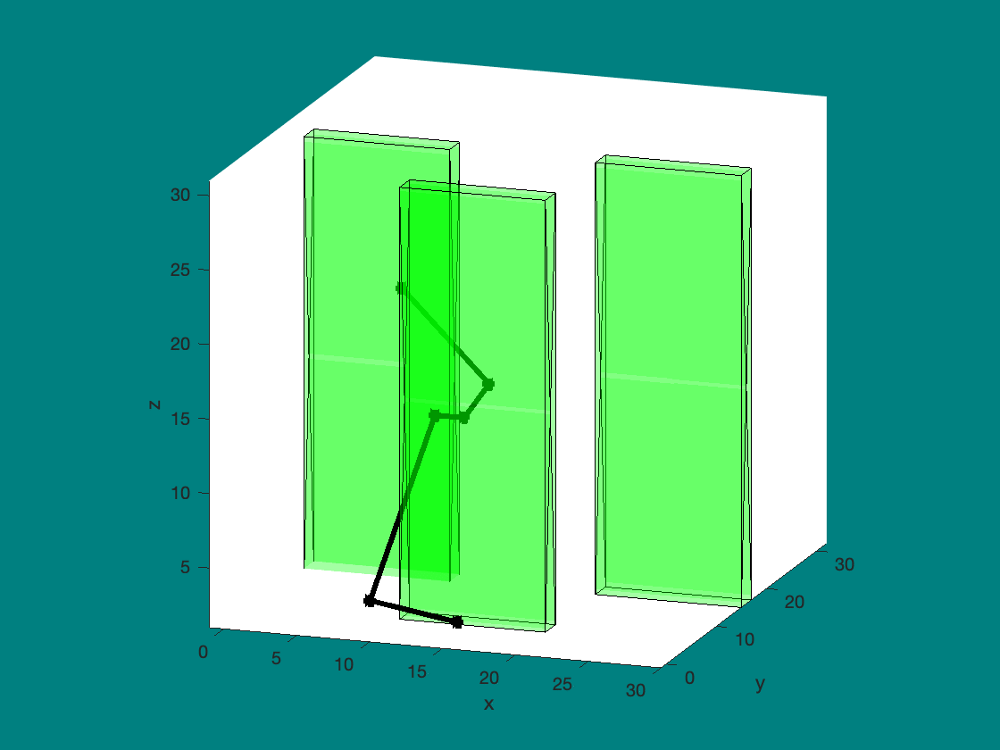 | 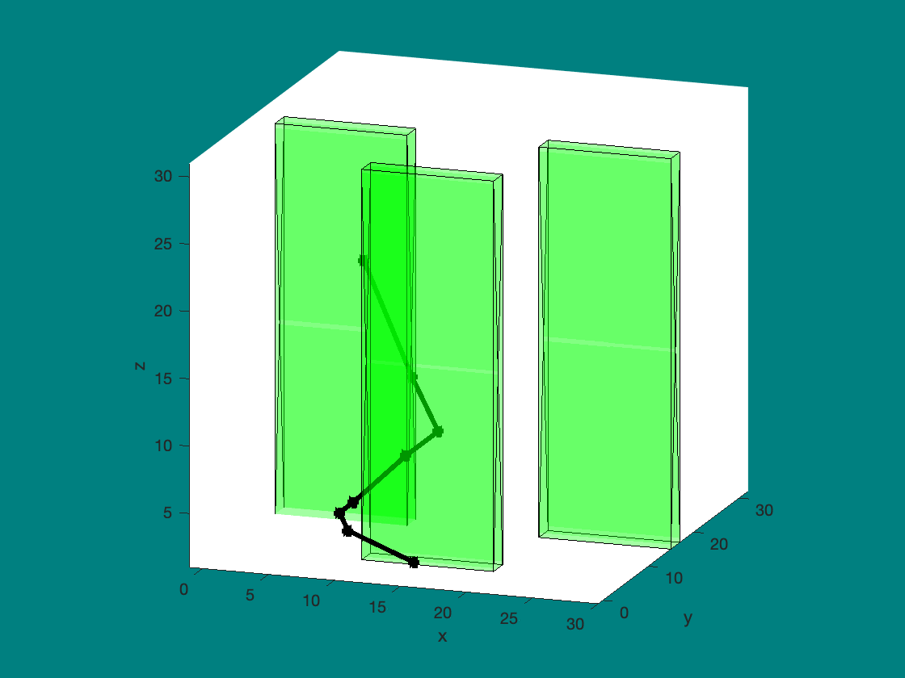 |
| 1.642271 seconds                                         | 0.755504 seconds                                   | 0.451664 seconds                               |

 

### Safe Flight Corridors

- ####  find_ellipsoid

  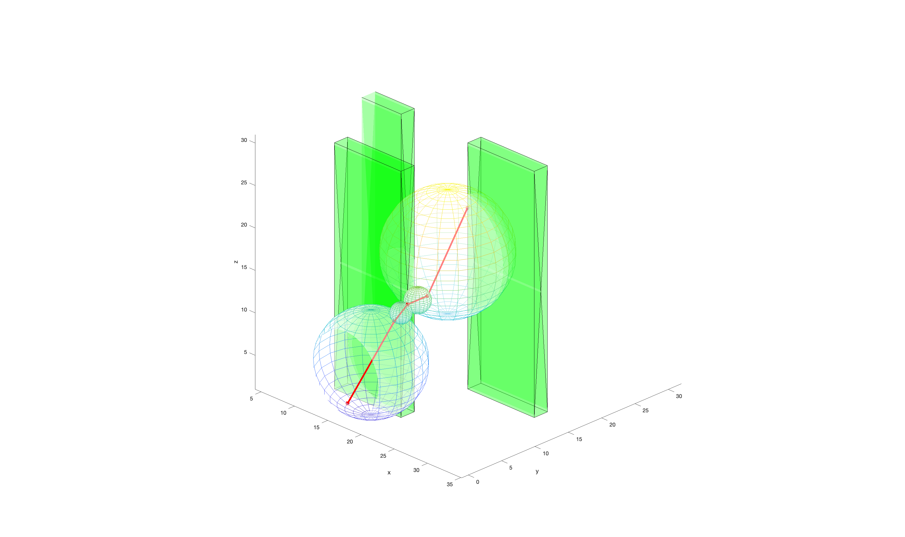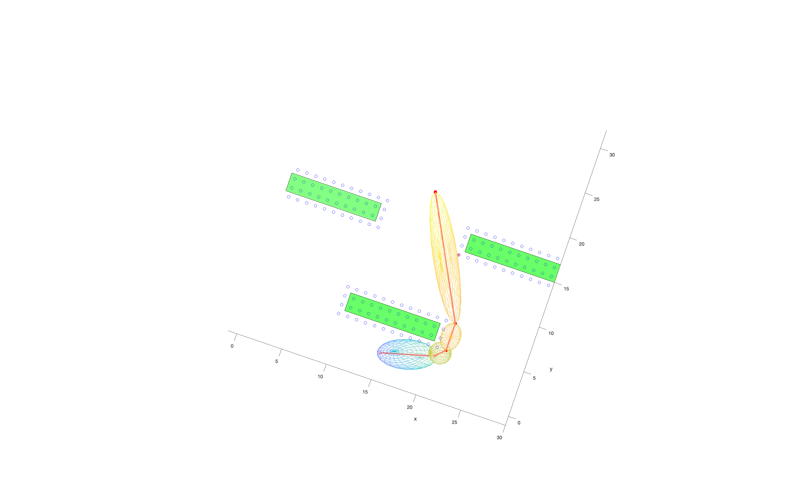

- #### find_polyhedron

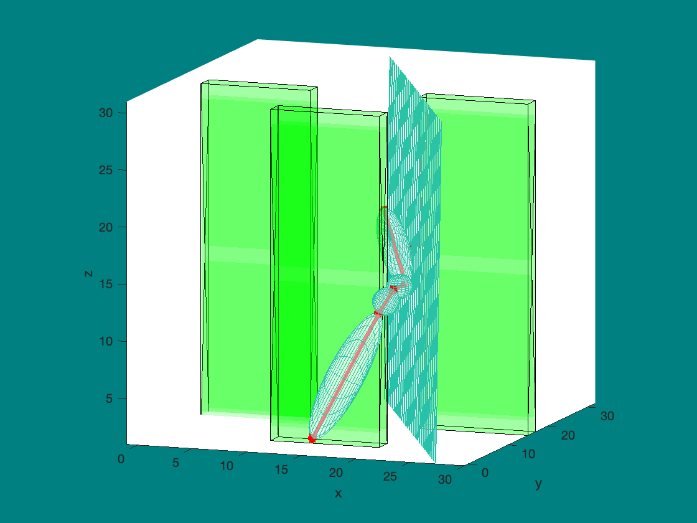

### Trajectory planning

Compare different Trajectory planning：

- #### Trajectory 1: use ['close form'](https://github.com/yrlu/quadrotor) get Trajectory planning.

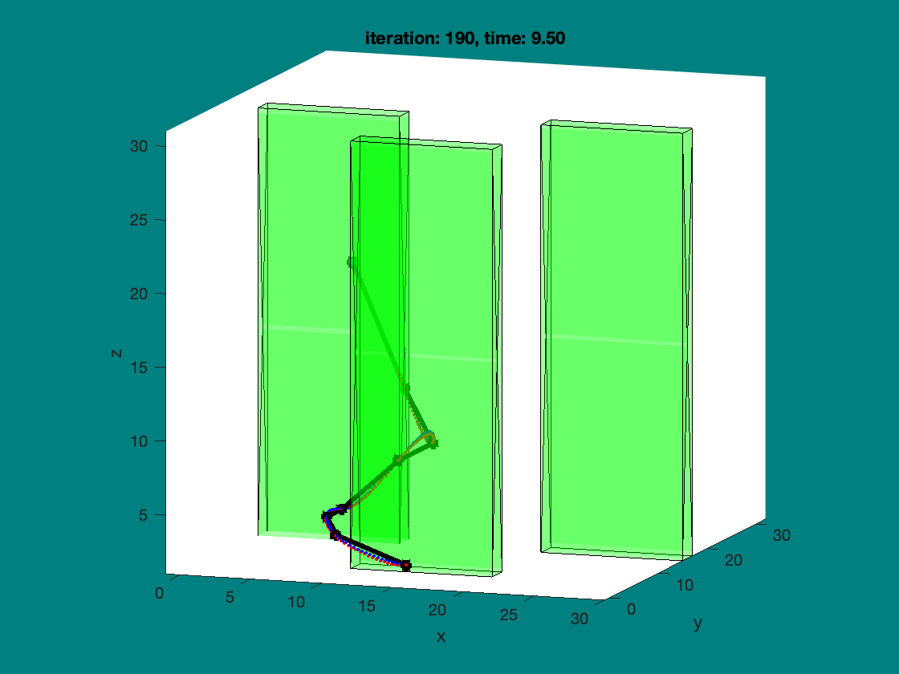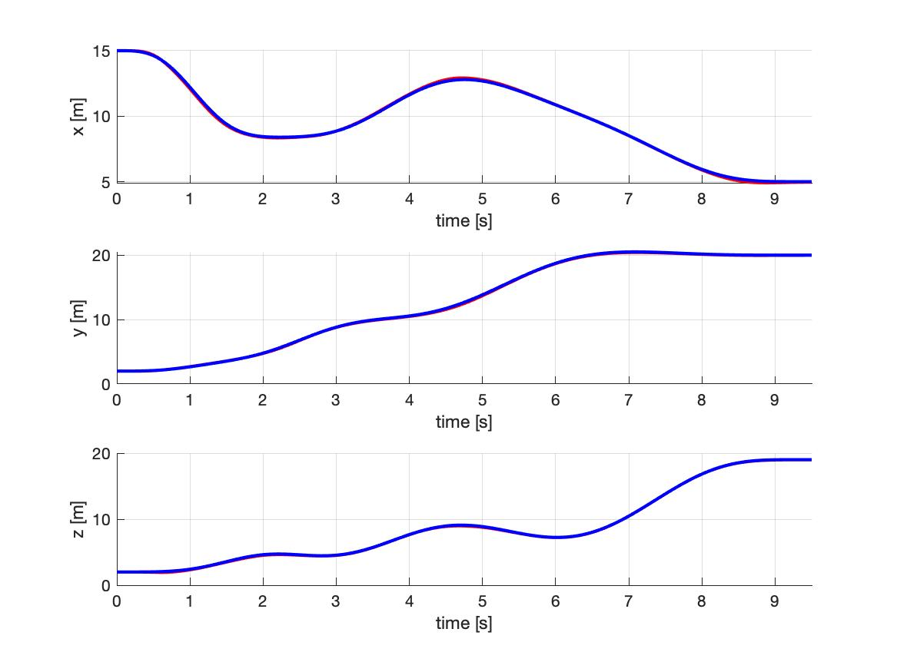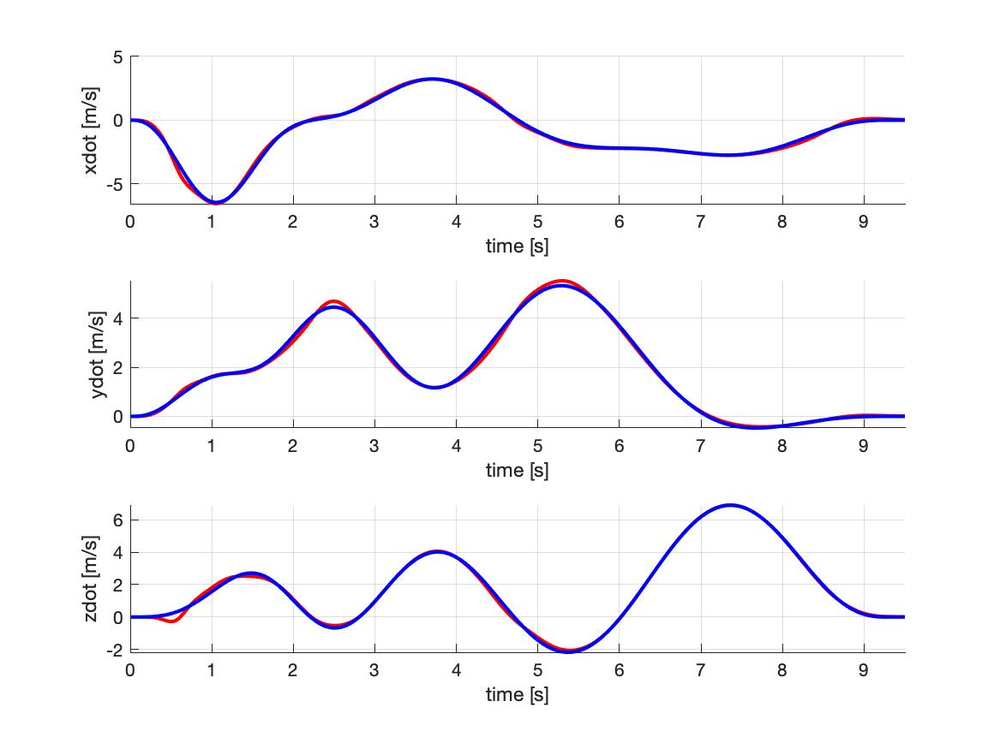 

The Trajectory pass every Path point.

- #### Trajectory 2: use 'Quadratic Programming' get Trajectory planning. use ['corridor constraints'](https://github.com/symao/minimum_snap_trajectory_generation) make  Ax< b.

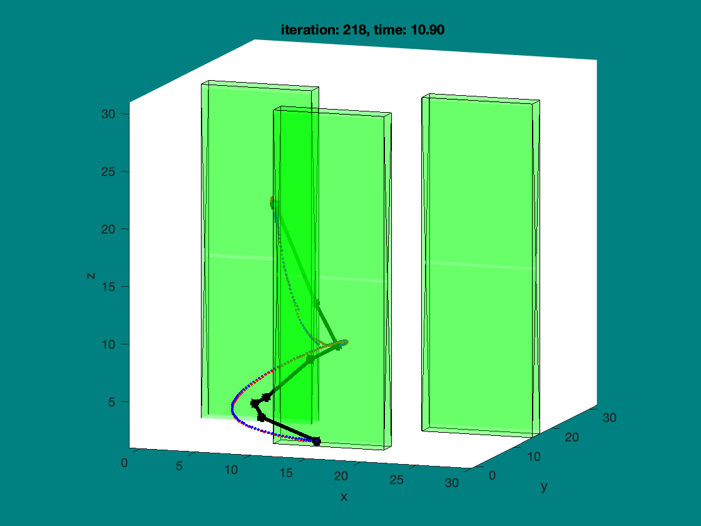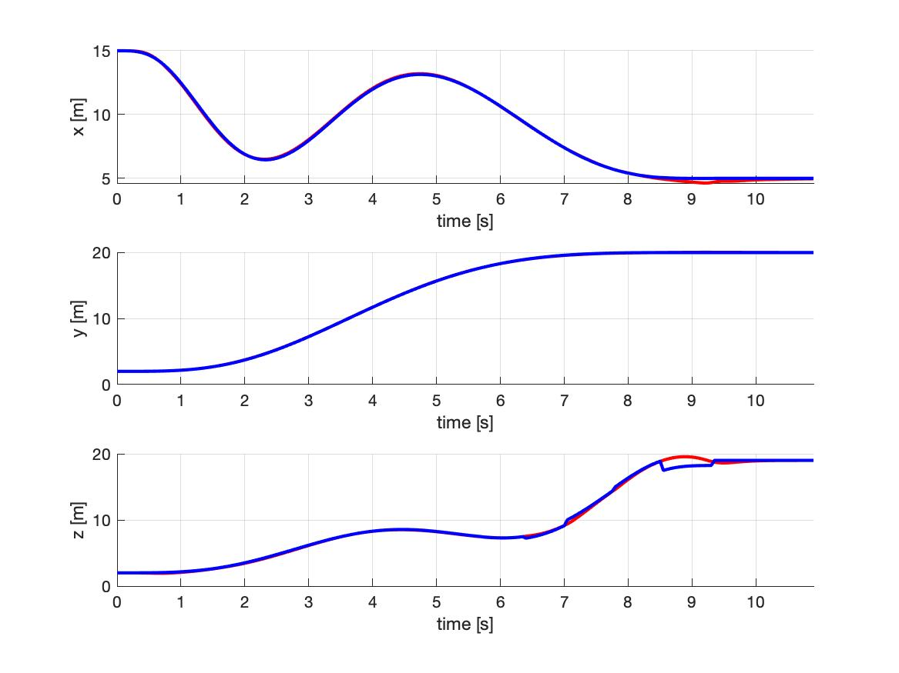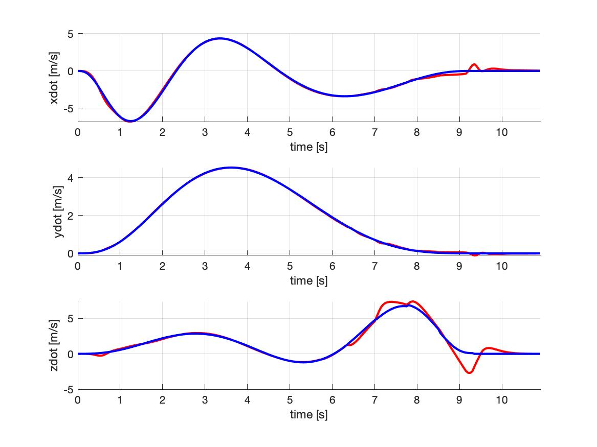 

The Trajectory don't need to pass every Path point.

minSnapValue(X + Y + Z) is : 9376.0901

- #### Trajectory 3: use 'Quadratic Programming' get Trajectory planning. use [SFC](Trajectory_planning/SFC) make Ax < b.

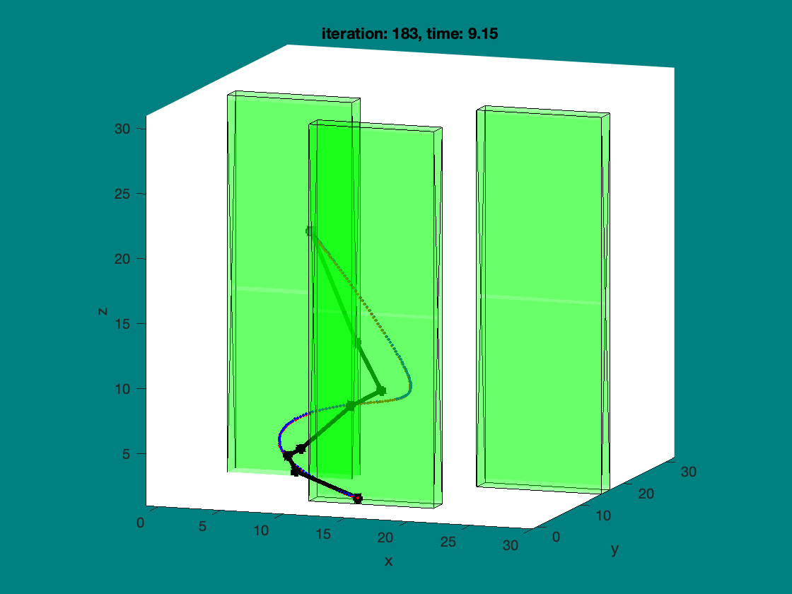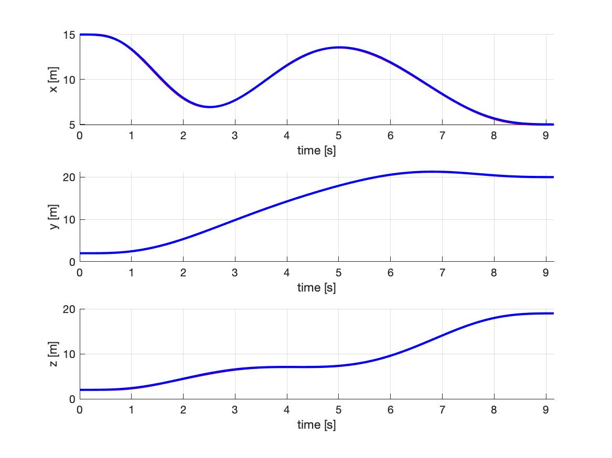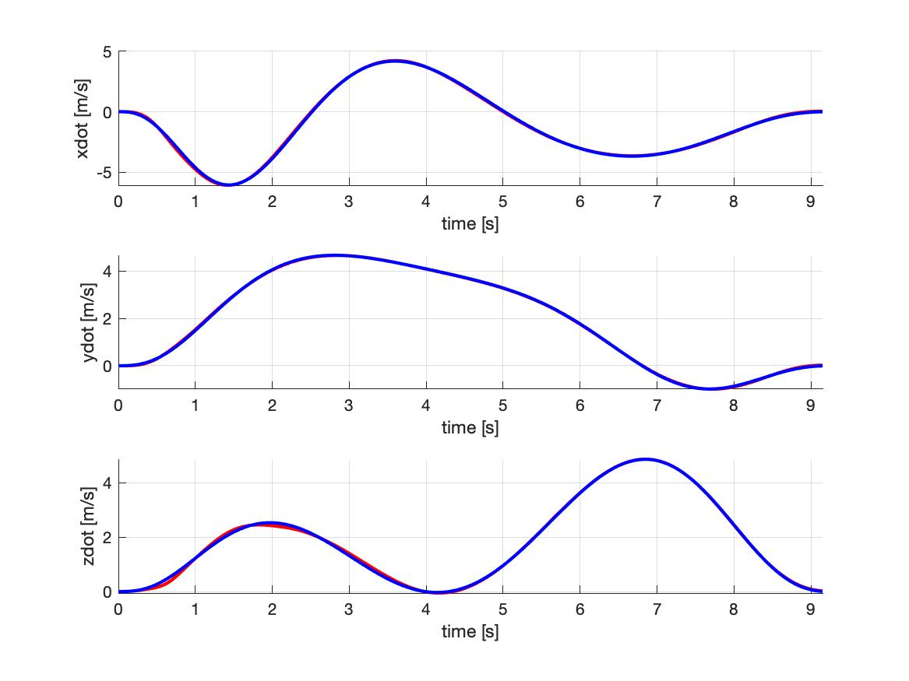 

The Trajectory don't need to pass every Path point.

minSnapValue(X + Y + Z) is : 2958.5877

### Trajectory tracking

Trajectory tracking by use PD Controller, you can learn by [coursera](https://www.coursera.org/learn/robotics-flight/home/welcome).

## User mannual

- Download the matlab 
- Download the code 
- set  [map](Trajectory_planning/maps/)  if you want try your map
- set startpoint and endpoint at runism.m
- run the code
- optionally, if you want the gif of the result, you could run makeGifAndJpg 

## Reference

##### Paper:

[1] D. Harabor and A. Grastien. 2011. "Online Graph Pruning for Pathfinding on Grid Maps". In Proceedings of the 25th National Conference on Artificial Intelligence (AAAI), San Francisco, USA.

[2] S. Liu, M. Watterson, K. Mohta, K. Sun, S. Bhattacharya, C.J. Taylor, et al., "Planning dynamically feasible trajectories for quadrotors using safe flight corridors in 3-d complex environments", IEEE Robotics and Automation Let- ters, vol. 2, no. 3, pp. 1688-1695, July 2017.

[3] D.W.Mellinger,"Trajectorygenerationandcontrolforquadrotors,"Ph.D. dissertation, Univ. Pennsylvania, Philadelphia, PA, 2012.

[4] D. Mellinger and V. Kumar, "Minimum snap trajectory generation and control for quadrotors", inProc. 2011 IEEE Int. Conf. Robot.Autom.,2011

[5] T. Lee, M. Leoky, and N. H. McClamroch, "Geometric tracking control of a quadrotor UAV on SE (3)," in *Proc. 49th IEEE Conf. Decis. Control*. IEEE, 2010, pp. 5420–5425.

##### Code:

https://github.com/sikang/DecompUtil

https://github.com/symao/minimum_snap_trajectory_generation

https://github.com/yrlu/quadrotor

